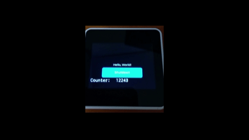

# M5Stack Core2でLVGLを使うための雛型

VSCode + PlatformIO用．LVGLは9.2を使用．



## この雛型での基本的な考え方

* 複数の画面を切り替えながら操作するようなアプリケーションを想定．
* 1画面を1つの単位としてプログラミング．
* LVGLの細々したところはmain.cppから追い出す．

ScreenBaseクラスから，用途毎に各スクリーンを派生させ，1画面=1インスタンスを作る．
その画面をScreenManagerに登録することで，画面の切り替えを行えるようにする．

コールバックの雛型も含める．

## 編集が必要なファイル

screen_id.h を編集し，スクリーンのID一覧を定義する．

## main.cppの流れ

### setup()
M5stackの初期化を行い，さらに，lvgl_setup() を呼び出してLGVLの初期化を行う．
次に，各スクリーンのインスタンスを初期化し，ScreenManagerに登録．

### loop()
各種処理(センサの読み出し等)を行い，さらに，ScreenManagerのloop()を呼び出す．これで，現在表示中のスクリーンのloop()が呼ばれる．

### main.cppの雰囲気

```C++
void setup() 
{
    auto cfg = M5.config();
    M5.begin(cfg);

    // LVGLの初期化
    lvgl_setup();

    // 各スクリーンのセットアップ
    scrn_main.setup();
    scrn_shutdown.setup();

    // スクリーンマネージャにスクリーンを追加
    // 最初に追加したスクリーンが最初に表示されるスクリーンになる
    scrn_manager.add_screen(SCREEN_ID_MAIN, &scrn_main);
    scrn_manager.add_screen(SCREEN_ID_SHUTDOWN, &scrn_shutdown);
}


void loop() 
{
    M5.update();

    // ここに各種処理を追加

    // 現在表示されているスクリーンのループ処理
    scrn_manager.loop();

    // LVGLのタスクハンドラを呼び出す
    lv_task_handler();

    delay(5);
}
```


## ScreenBase クラス

スクリーンを作成するとき，このクラスから派生させる．

### setup()

初期設定．必ず最初に，親クラスのsetup()を呼ぶこと．

画面を構成するLVGLのパーツ類をここで作成する．

### loop()

スクリーンがアクティブである間，繰り返し呼ばれる関数．画面の更新用．
スクリーンを切り替えて，他のスクリーンが表示されている場合には呼び出されない．

### on_load()

画面切り替えの際，画面が表示される直前に呼び出される．
描画状態の再初期化等を行いたい場合に実装する．

### on_unload()

画面切り替えの際，画面が表示対象から外される直前に呼び出される．


## ScreenManager クラス

複数のスクリーンの切り替えを行う．

add_screen()で，スクリーンIDと，スクリーンのインスタンスを登録する．

loop() を呼ぶことで，現在表示中のスクリーンのloop()を呼び出す．

change_screen()を呼ぶことで，スクリーンの切り替えを行う．

## 使用したフォント

メイン画面の等幅フォントの作成に，Myricaを使用．
https://myrica.estable.jp/

ターミナル画面のフォントの作成に，x14y24pxHeadUpDaisyを使用．
https://hicchicc.github.io/00ff/

### フォントの作成
fontconverterで，TTFファイルからC言語のソースに変換する．

https://lvgl.io/tools/fontconverter
